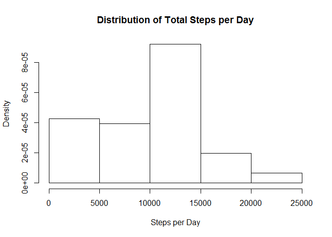
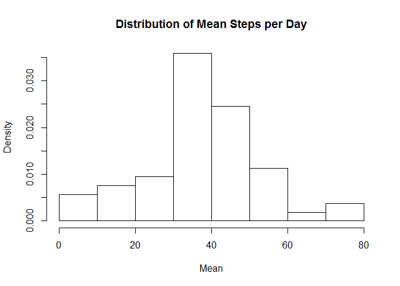
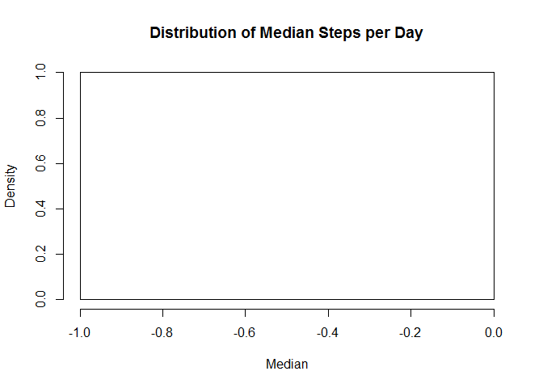
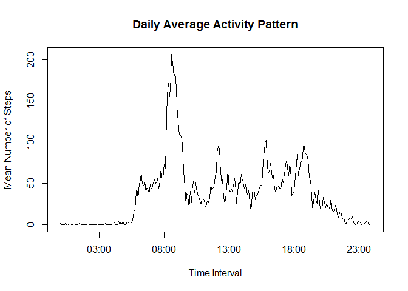
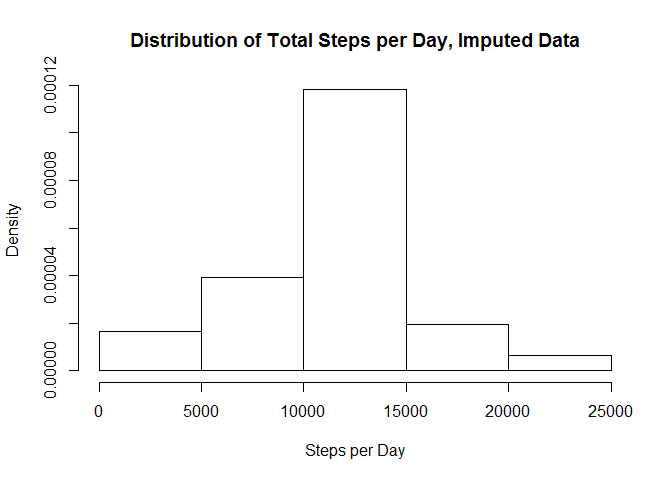
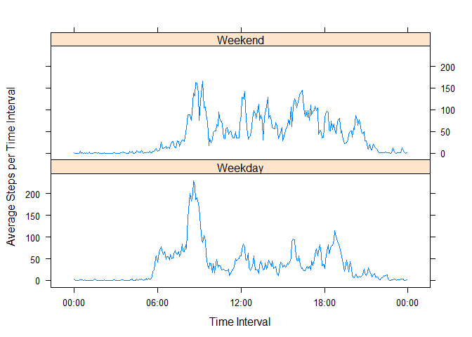

# Reproducible Research: Peer Assessment 1

## Loading and preprocessing the data
#### Read in the needed libraries

```r
echo = TRUE
library(data.table)
library(dplyr)
```

```
## 
## Attaching package: 'dplyr'
## 
## The following objects are masked from 'package:data.table':
## 
##     between, last
## 
## The following object is masked from 'package:stats':
## 
##     filter
## 
## The following objects are masked from 'package:base':
## 
##     intersect, setdiff, setequal, union
```
#### Read in the data into dataframes using data.table

```r
data.raw <- 
      data.table(read.csv(
"C:/Users/Chris/Documents/Coursera/Reproducible Research/Peer1/RawData/repdata_data_activity/activity.csv"))
data.process <- data.raw
```
#### Process the data frame into a useable format Convert the interval variable (integer) into a POSIXct time data type.  The day associated with the time will be the day the file is run, but the times will correspond to the iterval times.

```r
data.process <- mutate(data.process, time = sprintf("%04d", interval))
data.process <- mutate(data.process, 
      time = paste0(substr(time, 1,2), ":", substr(time, 3,4), ":00"))
data.process$time <- as.POSIXct(data.process$time, format = "%H:%M:%S")
```
#### Convert the date variable into a date data type and let's see what the data frame looks like

```r
data.process$date <- as.Date(data.raw$date)
str(data.process)
```

```
## Classes 'data.table' and 'data.frame':	17568 obs. of  4 variables:
##  $ steps   : int  NA NA NA NA NA NA NA NA NA NA ...
##  $ date    : Date, format: "2012-10-01" "2012-10-01" ...
##  $ interval: int  0 5 10 15 20 25 30 35 40 45 ...
##  $ time    : POSIXct, format: "2015-06-14 00:00:00" "2015-06-14 00:05:00" ...
##  - attr(*, ".internal.selfref")=<externalptr>
```

## What is the number of steps taken per day?

#### The total number of steps

```r
hist(tapply(data.process$steps, data.process$date, sum, na.rm = TRUE), 
     prob = TRUE,
     main = "Distribution of Total Steps per Day", xlab = "Steps per Day",
     ylab = "Density")
```

 

#### The average (mean) number of steps

```r
hist(tapply(data.process$steps, data.process$date, mean, na.rm = TRUE), 
     prob = TRUE,
     main = "Distribution of Mean Steps per Day", xlab = "Mean",
     ylab = "Density")
```

 

#### The median number of steps

```r
hist(tapply(data.process$steps, data.process$date, median, na.rm = TRUE), 
     prob = TRUE,
     main = "Distribution of Median Steps per Day", xlab = "Median",
     ylab = "Density")
```

 

#### Why is the median number of steps = 0?  Calculate the fraction of rows with 0's.


```r
sum(data.process$steps == 0, na.rm = TRUE)/nrow(data.process)
```

```
## [1] 0.6269353
```
#### Okay then, 63% of the rows have 0's, therefore the median has to be 0.

## What is the average daily activity pattern?

#### Create a new dataframe with the reduced data set of interval times and mean steps.  Use tapply to create a list of interval means.  It will have an attribute that is the name of the interval the steps were averaged over.  The time interval will be character data that includes the day the script is run and the time.

```r
meanSteps <- tapply(data.process$steps, data.process$time, mean, na.rm = TRUE)
```

####To pull out the interval period data, will unlist into a new list of just the interval period names.

```r
timeIntervals <- unlist(attributes(meanSteps))
```

#### Clean up the list to just a vector of the interval names

```r
attributes(timeIntervals) <- NULL
```

#### The first element is the length of vector.  Clean up to just the interval periods.  This is a character vector.

```r
timeIntervals <- timeIntervals[2:289]
```

#### Convert the character date-times to POSIXct date type.

```r
timeIntervals <- as.POSIXct(timeIntervals)
```

#### Go back and unlist to eliminate the attributes and just leave the numeric mean number of steps

```r
attributes(meanSteps) <- NULL
```

#### Assemble into a data frame

```r
data.daily <- data.frame(timeIntervals, meanSteps)
```

#### Plot the data

```r
plot(data.daily$timeIntervals, data.daily$meanSteps, type = "l",
     main = "Daily Average Activity Pattern",
     xlab = "Time Interval", ylab = "Mean Number of Steps")
```

 

#### Which time period, on average across all the days in the dataset, contains the maximum number of steps?

```r
data.daily[data.daily$meanSteps == max(data.daily$meanSteps), ]
```

```
##           timeIntervals meanSteps
## 104 2015-06-14 08:35:00  206.1698
```


## Imputing missing values

#### Number of rows with NA's

```r
sum(is.na(data.process$steps))
```

```
## [1] 2304
```
#### To impute the missing data will use the previously calculated average of the 5 minute period on the missing data.  Start by creating a TRUE/FALSE list of the locations the data is missing and then sequentually insert the data for each time interval.

```r
naList <- is.na(data.process$steps)

data.imputed <- data.process

for (i in seq_along(data.imputed$steps)) {
      if (naList[i]) {timeIndex <- data.imputed$time[i]
            data.imputed$steps[i] <- 
            data.daily$meanSteps[data.daily$timeInterval == timeIndex]} 
}
```

#### Number of steps per day with the imputed data

```r
hist(tapply(data.imputed$steps, data.imputed$date, sum), prob = TRUE,
     main = "Distribution of Total Steps per Day, Imputed Data", 
     xlab = "Steps per Day", ylab = "Density")
```

 

#### Table of mean, median and totals of imputed and non-imputed data

```r
processed <- c(mean(data.process$steps, na.rm = TRUE), 
      median(data.process$steps, na.rm = TRUE), sum(data.process$steps, 
      na.rm = TRUE))
imputed <- c(mean(data.imputed$steps), median(data.imputed$steps), 
      sum(data.imputed$steps))
data.table <- cbind(processed, imputed)
rownames(data.table) <- c("mean", "median", "total")
data.table
```

```
##          processed     imputed
## mean       37.3826     37.3826
## median      0.0000      0.0000
## total  570608.0000 656737.5094
```
#### These are the same because I used to the average of each period to impute the missing data.

## Are there differences in activity patterns between weekdays and weekends?

#### Create a factor to define if the date of the observation is a weekend or a weekday

```r
daytype <- weekdays(data.imputed$date)
daytype <- ifelse(daytype == "Saturday" | daytype == "Sunday",
      "Weekend", "Weekday")
data.imputed$daytype <- as.factor(daytype)
```

#### Get the means of the weekdays and weekends

```r
stepDays <- aggregate(data.imputed$steps, 
      list(data.imputed$time, data.imputed$daytype), mean)
stepDays <- rename(stepDays, date = Group.1, daytype = Group.2, means = x)
```

#### Make a time series panel plot of of average steps taken on a week day and weekend day

```r
library(lattice)
xyplot(means ~ date | daytype, data = stepDays, 
      xlab = "Time Interval", ylab = "Average Steps per Time Interval",
      scales = list(x = list(format = "%H:%M")), layout = c(1, 2), type = "l")
```

 

